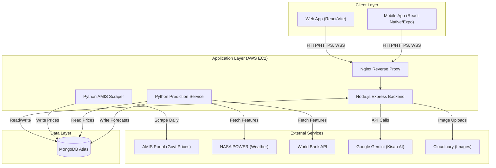

# 1. System Architecture & Technology Stack

This document outlines the high-level architecture of the FarmKonnect platform, detailing how the Web Frontend, Mobile App, Node.js Backend, and Machine Learning services interact.

## 1.1 High-Level Architecture Diagram

The FarmKonnect ecosystem is built on a microservices-inspired architecture deployed via Docker on AWS EC2, with a unified MongoDB database handling data persistence.

## 1.2 Technology Stack

The platform is designed to be highly scalable, utilizing modern frameworks and cloud-native practices.

### 1.2.1 Web Frontend
- **Core Framework**: React.js
- **Build Tool**: Vite (for rapid hot-module replacement and optimized builds)
- **Styling**: Tailwind CSS (with Dark Mode support)
- **State Management**: React Context API (`AuthContext`, `LanguageContext`, `ThemeContext`)
- **Routing**: React Router DOM
- **Data Visualization**: Recharts (for rendering historical prices, forecasts, and confidence bands)
- **Icons**: Lucide React

### 1.2.2 Mobile Application
- **Core Framework**: React Native
- **Toolchain**: Expo (EAS for builds and OTA updates)
- **Styling**: NativeWind (Tailwind for React Native)
- **Navigation**: React Navigation (Bottom Tabs, Stack Navigators)
- **Real-Time**: `socket.io-client` for live chat messaging
- **Device APIs**: `expo-location` (for localized weather/prices), `expo-notifications` (Push), `expo-image-picker`

### 1.2.3 Backend API
- **Runtime**: Node.js
- **Framework**: Express.js
- **Database ORM**: Mongoose
- **Real-Time Engine**: Socket.io
- **Authentication**: JSON Web Tokens (JWT) & bcryptjs for password hashing
- **File Uploads**: Multer & Cloudinary SDK
- **AI Integration**: `@google/generative-ai` (Gemini 1.5 Flash)

### 1.2.4 Machine Learning & Data Pipeline
- **Language**: Python 3.10+
- **Machine Learning**: LightGBM (`lightgbm`), Scikit-Learn
- **Data Processing**: Pandas, PyArrow (for Parquet storage), NumPy
- **Web Scraping**: BeautifulSoup4, Requests
- **Database Driver**: PyMongo (for bulk upserts to Atlas)

### 1.2.5 Infrastructure & Deployment
- **Hosting**: AWS EC2 (Ubuntu)
- **Containerization**: Docker & Docker Compose
- **Database**: MongoDB Atlas (Cloud-hosted NoSQL cluster)
- **CI/CD**: GitHub Actions (Automated linting, building, and SSH-based deployments)

## 1.3 Request Flow Example

When a user opens the Price Trends dashboard on the Web or Mobile app:
1. The **Frontend** makes an HTTP GET request to `/api/prices/forecast?commodity=Wheat&city=Faisalabad`.
2. **Nginx** routes the request to the **Node.js Backend**.
3. The **Backend** queries **MongoDB Atlas** for the latest historical prices (`commodityprices`) and the pre-computed machine learning forecasts (`pricepredictions`).
4. The database returns the data payload in milliseconds.
5. The **Backend** formats the data and returns a JSON response.
6. The **Frontend** parses the JSON and plots the solid green history line and the dashed orange forecast line using Recharts.
