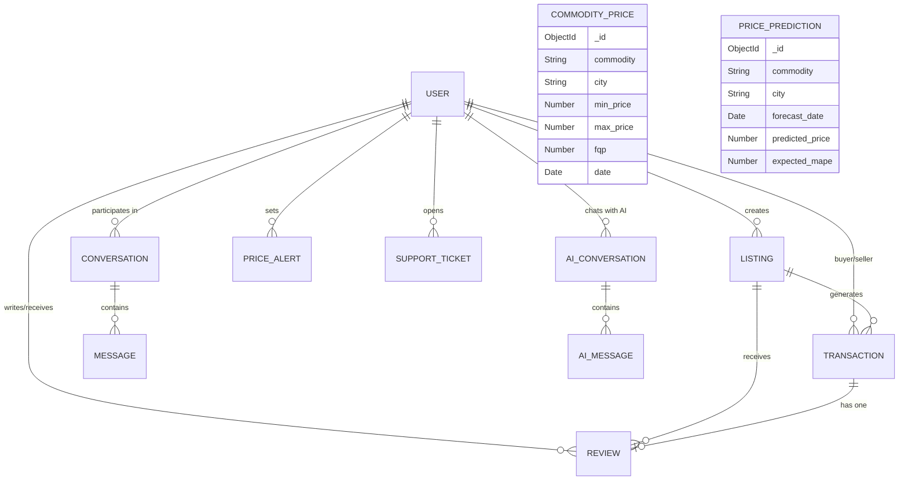

# 2. Database Schema & Design

FarmKonnect uses **MongoDB Atlas**, a NoSQL database, to provide high availability and flexible schema design. This document outlines the Entity Relationship Diagram (ERD) and the core collections used in the platform.

## 2.1 Entity Relationship Diagram (ERD)

Although MongoDB is a NoSQL database without rigid foreign key constraints, Mongoose `ObjectId` references are heavily used to link related documents and maintain data integrity.

## 2.2 Core Collections

### 2.2.1 `users`
The core identity document for all actors (farmers, buyers, admins) on the platform.
- `name`: Full name of the user.
- `email`: Unique identifier and login credential.
- `password`: bcrypt-hashed password.
- `role`: Role-based access control (`user`, `admin`).
- `location`: Stores the user's city and GPS coordinates for distance-based sorting.
- `isEmailVerified`: Boolean flag for security.

### 2.2.2 `listings`
Represents a physical agricultural product available for sale on the marketplace.
- `seller`: `ObjectId` referencing the `User`.
- `title`, `description`: Textual metadata.
- `price`, `quantity`, `unit`: Pricing matrices (e.g., Rs/40Kg).
- `category`: Broad category (e.g., Grains, Fruits, Vegetables).
- `images`: Array of Cloudinary secure URLs.
- `location`: Geospatial data defining where the crop is located.
- `status`: `active`, `sold`, or `inactive`.

### 2.2.3 `transactions`
Handles the e-commerce and B2B trading flows securely.
- `buyer`, `seller`: `ObjectId` references.
- `listing`: `ObjectId` of the crop being purchased.
- `amount`: Total fiat value of the transaction.
- `status`: State machine (`pending`, `accepted`, `completed`, `cancelled`, `disputed`).
- `paymentMethod`: `cash`, `bank_transfer`, `stripe`.
- `stripePaymentIntentId`: Optional hook for external payment gateways.

### 2.2.4 `conversations` & `messages`
Supports the Real-Time Socket.io chat system.
- `Conversation`: Links two users (`participants: [UserA, UserB]`) and a related `Listing`.
- `Message`: Contains the actual text payload, a sender reference, and a read-receipt boolean (`read: false`).

### 2.2.5 `commodityprices` (AMIS Data)
A massive historical collection containing over 270,000 daily price records scraped from the government AMIS portal.
- Includes `commodity`, `variety`, `city`, `fqp` (Floor/Quoted Price), and `date`.
- Features an `excluded: true` flag for statistically detected outliers.

### 2.2.6 `pricepredictions` (Machine Learning Output)
The output destination for the Python LightGBM forecasting service.
- `commodity`, `city`, `horizon_weeks`: Defines the cell.
- `forecast_date`: The specific future date the prediction targets.
- `predicted_price`: The absolute rupee value expected.
- `expected_mape`: Mean Absolute Percentage Error (powers the confidence bands on the frontend chart).
