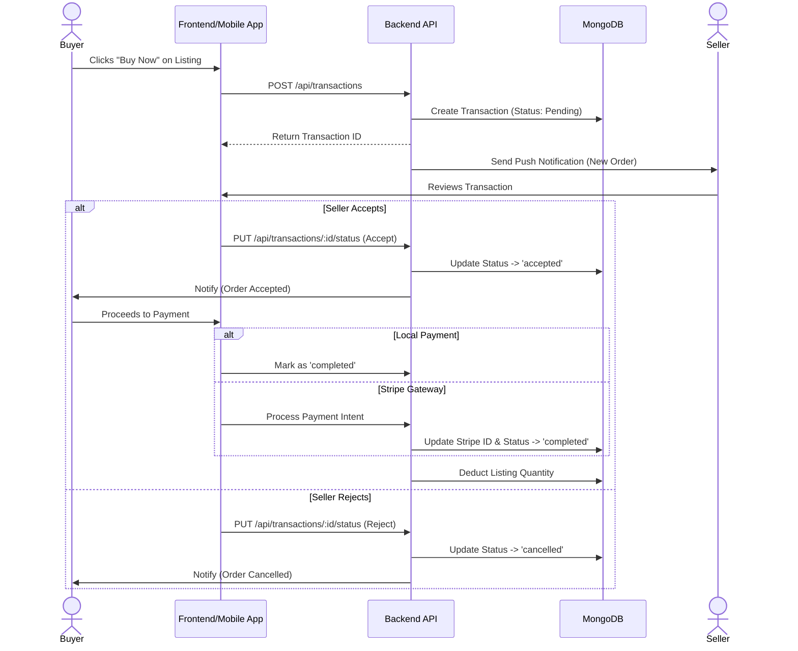
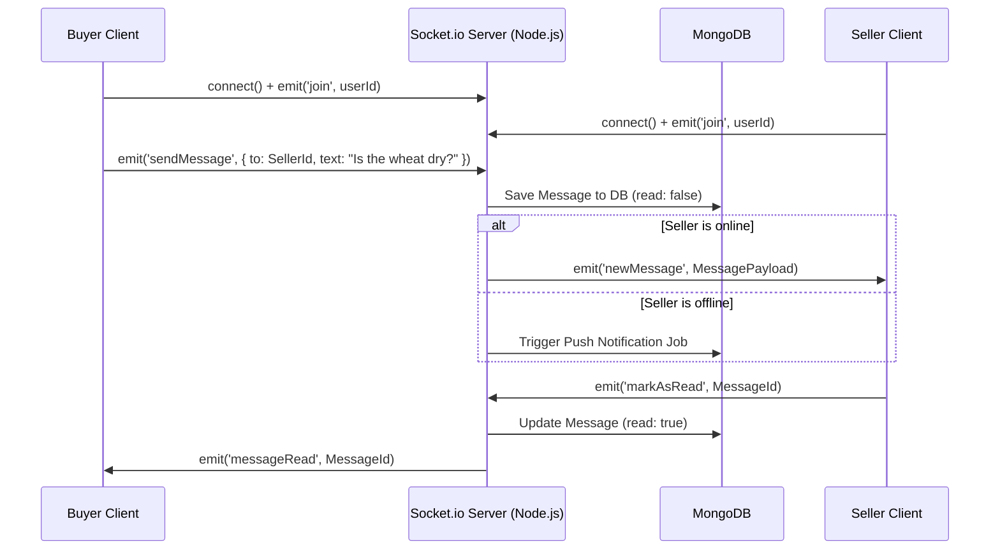

# 4. Transactions and Real-Time Chat

This document maps out the specific data flows and logic for user-to-user negotiations, order placement, and real-time chat in the FarmKonnect system.

## 4.1 Order & Transaction Lifecycle

The FarmKonnect marketplace acts as an escrow-like state machine between the farmer (seller) and the buyer.

### 4.1.1 Status Definitions
- `pending`: The buyer has requested the crop. The inventory is locked but not deducted.
- `accepted`: The seller has verified they can fulfill the order.
- `completed`: Payment has been resolved (either manually acknowledged for cash/transfer or automatically verified via Stripe webhook). Inventory is permanently deducted.
- `cancelled`: Either party aborted the trade. Inventory lock is released.

## 4.2 Real-Time Communication (Socket.io)

For B2B agricultural trading, negotiation is critical. FarmKonnect implements a fully real-time messaging system.

### 4.2.1 Real-Time Architecture Details
- **Namespace & Rooms**: Users join a personal Socket.io room based on their `userId`. This allows the server to cleanly route private messages.
- **Persistence**: Every socket emission is backed by a database write to the `messages` collection. This ensures that if a user loses connection, they retrieve the full history via HTTP (`GET /api/chat/history`) upon reconnecting.
- **Typing Indicators**: Ephemeral socket events (`typing`, `stopTyping`) are broadcasted to enhance the UX without hitting the database.
