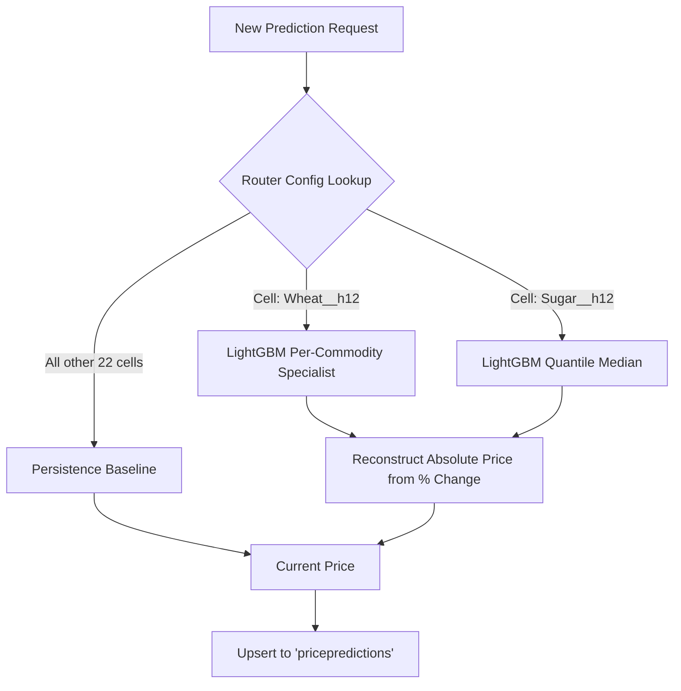

# 5. Machine Learning Pipeline & Price Forecasting

The defining technical feature of FarmKonnect is its Machine Learning predictive engine. This system forecasts wholesale (FQP) prices for 6 commodities across 14 cities at horizons of 1, 2, 4, and 12 weeks.

## 5.1 The Data Pipeline

Because agricultural prices are heavily influenced by external macroeconomic factors, the pipeline enriches the raw AMIS price data with 56 additional features.

```mermaid
graph TD
    A[AMIS Scraper (Daily)] -->|FQP Prices| B(MongoDB 'commodityprices')
    
    B -->|Hourly Pipeline Tick| C{build_panel.py}
    
    C -->|Resample to W-FRI| D[Weekly Baseline Panel]
    
    D --> E[build_features.py]
    
    subgraph External Fetchers
        W[NASA POWER API - Local Weather]
        F[Yahoo Finance - Futures/FX]
        M[World Bank - Global Prices]
    end
    
    W --> E
    F --> E
    M --> E
    
    E -->|Enriched Panel| F2[build_lagged.py]
    
    F2 -->|Add Lags| G[features_lagged.parquet]
    
    G --> H(Inference Service)
```

### 5.1.1 Avoiding Data Leakage
A critical component of time-series forecasting is preventing target leakage.
- **W-FRI Resampling**: Daily prices are averaged into a Friday-anchored week (`W-FRI`).
- **Lagging (`build_lagged.py`)**: The model is mathematically prevented from seeing "future" exogenous data by enforcing a strict 1-week lag on all Weather, Futures, and World Bank variables.

## 5.2 The Forecasting Router

Pakistani mandi prices are heavily dictated by government interventions (Minimum Support Prices, Export Bans) and are highly "sticky." 

Extensive modeling proved that for 22 out of 24 forecast cells (Commodity x Horizon), **Persistence** ("the price next week will be the same as today") is statistically superior to any learned model. The system embraces this via a dynamic `router_config.json`.



### 5.2.1 Why Percentage Change?
The LightGBM models do not predict the absolute price (e.g., Rs 3500). They predict the **Percentage Change** (e.g., +4.2%). This standardizes the loss function across vastly different price scales (Sugar at Rs 150/Kg vs Wheat at Rs 3500/40Kg).

## 5.3 Live Monitoring & Drift Detection (`monitor.py`)

To ensure the models do not silently fail when government policies change (e.g., the 2026 Wheat Deregulation), the prediction container runs an hourly self-monitoring script.

1. It queries `pricepredictions` for forecasts where the `forecast_date` is now in the past.
2. It queries `commodityprices` for the actual price on that date.
3. It computes the **Mean Absolute Percentage Error (MAPE)**.
4. If the live rolling MAPE exceeds `1.5x` the router's expected MAPE, a **Drift Alarm** is triggered, alerting administrators that the model needs retraining.

## 5.4 Automated MLOps Retraining

The machine learning models undergo a fully automated retraining process. A GitHub Actions CI/CD pipeline (mlops-retrain.yml) runs on the 1st of every month to:

1. Connect to the EC2 server and extract the latest processed datasets.
2. Retrain the baseline, global LightGBM, per-commodity specialist, and quantile models.
3. Rebuild the 
outer_config.json logic using the latest performance metrics.
4. Automatically commit the new .joblib model weights back to the repository.
5. Restart the prediction service on EC2, triggering an immediate 12-week price backfill with the fresh models.

This pipeline ensures that the models adapt to changing macroeconomic conditions and government policies without requiring manual intervention. For more details on the playbook, see ml/RETRAIN.md.
